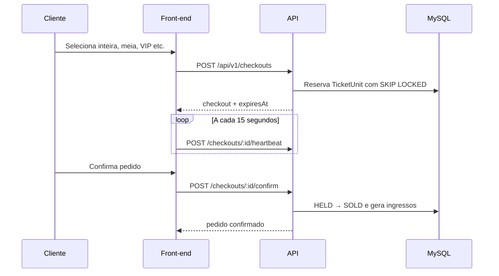

# Back-end da plataforma de ingressos

Este documento explica como o back-end foi organizado, o que cada parte faz e como o front-end em Next.js deve consumir a API.

## Visão geral

O sistema vende ingressos para eventos locais sem carrinho persistente. A jornada é:

```text
evento → seleção local → checkout com reserva → confirmação → ingresso → validação na portaria
```

Na página do evento, o front mantém os tipos e quantidades apenas no estado local. Quando o cliente clica em **Continuar**, o back cria um checkout e reserva unidades reais durante no máximo 15 minutos.



Não existem os modelos `Cart` ou `CartItem` e não deve existir uma tela de carrinho.

## Tecnologias

- Node.js 22 e TypeScript;
- NestJS 11 para API, módulos, guards e jobs;
- Prisma 7 e MySQL 8.4 para persistência e transações;
- Zod 4 como fonte dos DTOs, validação e schemas OpenAPI;
- Better Auth para cadastro, login, sessões e recuperação de conta;
- MinIO para imagens de eventos;
- Mailpit para visualizar e-mails no desenvolvimento;
- Pino para logs JSON;
- Swagger e OpenAPI para documentação e geração do cliente do front.

## Estrutura de pastas

| Caminho | Responsabilidade |
|---|---|
| `prisma/schema.prisma` | Modelos, relações, enums e índices do banco |
| `prisma/migrations/` | Histórico versionado das alterações do MySQL |
| `prisma/seed.ts` | Admin e dados demonstrativos criados de forma idempotente |
| `src/auth/` | Better Auth, sessão e verificação de papéis |
| `src/profile/` | Nome, telefone, CPF protegido e endereço do cliente |
| `src/events/` | Categorias, eventos, tipos, capacidade e imagens |
| `src/checkouts/` | Reserva, heartbeat, expiração, cancelamento e confirmação |
| `src/payments/` | Interface de pagamento e implementação simulada |
| `src/tickets/` | Pedidos, ingressos, QR e validação da portaria |
| `src/invitations/` | Convites para organizadores e equipes de portaria |
| `src/analytics/` | Funil, receita simulada, ocupação e validações |
| `src/common/` | Erros, auditoria, idempotência, decorators e `requestId` |
| `src/storage/` | Comunicação com o MinIO |
| `src/health/` | Liveness, readiness e limpezas periódicas |
| `scripts/generate-openapi.ts` | Geração dos contratos OpenAPI |
| `test/` | Testes integrados contra MySQL real |

## Responsabilidade dos módulos

### Autenticação e autorização

O Better Auth atende `/api/auth/*` e mantém as sessões no MySQL. O cadastro público cria um cliente. Os papéis são:

- `customer`: compra e consulta seus ingressos;
- `organizer`: administra seus próprios eventos;
- `gate_staff`: valida ingressos dos eventos atribuídos;
- `admin`: possui acesso global.

O front não deve guardar token manualmente. A autenticação usa cookie HttpOnly e todas as requisições devem enviar credenciais.

### Perfil e CPF

O checkout só é permitido quando o e-mail está verificado e o perfil está completo. O CPF:

- é normalizado e validado;
- é criptografado com AES-256-GCM;
- possui um HMAC separado para busca e unicidade;
- nunca é devolvido integralmente pela API.

### Eventos e tipos de ingresso

O organizador cria eventos inicialmente como `DRAFT`. Para publicar, o evento precisa ter local, categoria, datas futuras, capa e ao menos um tipo ativo.

Cada `TicketType` representa uma categoria comercial, por exemplo inteira, meia, VIP ou lote promocional. Ele define preço, capacidade, janela de venda e limite por pedido.

### Estoque inspirado na Shopify

Cada ingresso possível é uma linha `TicketUnit`:

| Estado | Significado |
|---|---|
| `AVAILABLE` | Pode ser reservado |
| `HELD` | Está preso a um checkout ativo |
| `SOLD` | Pertence a um pedido confirmado |

A reserva usa transação `READ COMMITTED` e `FOR UPDATE SKIP LOCKED`. Assim, duas pessoas podem tentar comprar simultaneamente sem vender a mesma unidade. Se um checkout solicitar dois tipos e um deles não tiver estoque, toda a transação é desfeita.

### Checkout e presença

- Dura no máximo 15 minutos;
- exige heartbeat do dono a cada 15 segundos;
- após 60 segundos sem heartbeat é considerado abandonado;
- heartbeat nunca aumenta o prazo absoluto;
- seleção e quantidades ficam imutáveis após a criação;
- cada usuário pode ter somente um checkout ativo;
- expiração, abandono e cancelamento liberam as unidades.

Um job executado a cada 10 segundos procura reservas vencidas ou abandonadas.

### Pedidos e QR

A confirmação simulada transforma as unidades em `SOLD`, cria um pedido com snapshots e emite um ingresso individual por unidade. O QR contém apenas o ID público e uma assinatura HMAC.

A primeira leitura autorizada marca o ingresso como `USED`. Uma nova leitura retorna `TICKET_ALREADY_USED`. A ordem dos locks também impede que o cancelamento devolva ao estoque uma unidade usada simultaneamente.

### Imagens e e-mail

O MinIO armazena uma capa e até seis imagens de galeria por evento. São aceitos JPG, PNG e WebP de até 5 MB, com validação de MIME e assinatura do arquivo. Remoções que falham entram numa fila persistente para nova tentativa.

O Mailpit recebe e-mails de verificação, recuperação e convites no ambiente local.

## Endereços locais

Depois de executar `docker compose up --build` na raiz:

| Serviço | Endereço |
|---|---|
| Front-end | http://localhost:3000 |
| API | http://localhost:3001 |
| Swagger | http://localhost:3001/docs |
| Mailpit | http://localhost:8025 |
| MinIO Console | http://localhost:9001 |

## Como executar

Ambiente completo:

```bash
docker compose up --build
```

Back-end isolado, com as dependências externas já disponíveis:

```bash
cd backend
npm install
npm run prisma:generate
npm run prisma:deploy
npm run seed
npm run dev
```

Verificações:

```bash
npm run typecheck
npm run lint
npm test
npm run build
```

Teste concorrente contra MySQL real:

```bash
RUN_INTEGRATION=true npm test
```

## Contratos para o front-end

Existem dois contratos:

- `docs/openapi.json`: endpoints da aplicação;
- `docs/auth-openapi.json`: endpoints do Better Auth.

Quando um endpoint ou DTO mudar, execute:

```bash
cd backend
npm run openapi:generate

cd ../frontend
npm run api:generate
```

O arquivo `frontend/src/lib/api/schema.d.ts` é gerado automaticamente e não deve ser editado manualmente. A CI falha se o contrato ou o cliente estiver desatualizado.

## Como implementar no front-end

### 1. Variável de ambiente

Crie `frontend/.env.local`:

```env
NEXT_PUBLIC_API_URL=http://localhost:3001
```

### 2. Clientes já preparados

As rotas da aplicação usam `frontend/src/lib/api/client.ts`:

```ts
import { api } from '@/lib/api/client';

const { data, error } = await api.GET('/api/v1/events', {
  params: { query: { page: 1, pageSize: 20 } },
});
```

Autenticação usa `frontend/src/lib/auth-client.ts`:

```ts
import { authClient } from '@/lib/auth-client';

await authClient.signIn.email({ email, password });
await authClient.signUp.email({ name, email, password });
await authClient.signOut();
```

Não misture os clientes: `authClient` é usado para `/api/auth/*`; `api` é usado para `/api/v1/*`.

### 3. Página pública de eventos

Fluxo recomendado:

1. `GET /api/v1/categories` para montar os filtros;
2. `GET /api/v1/events` para vitrine, pesquisa e paginação;
3. `GET /api/v1/events/:slug` para a página de detalhes;
4. `GET /api/v1/events/:id/availability` para atualizar a disponibilidade.

Eventos esgotados continuam na vitrine, mas o botão de continuar deve ficar desabilitado.

### 4. Seleção sem carrinho

Na página do evento, mantenha a seleção apenas em estado React:

```ts
type Selection = Record<string, number>;

const [selection, setSelection] = useState<Selection>({});

function changeQuantity(ticketTypeId: string, quantity: number) {
  setSelection((current) => ({
    ...current,
    [ticketTypeId]: Math.max(0, quantity),
  }));
}
```

Não salve isso no banco e não crie `/cart`. Opcionalmente, o front pode usar `sessionStorage` apenas para evitar perder a seleção antes de iniciar o checkout.

### 5. Iniciar checkout

Converta a seleção e gere uma chave UUID:

```ts
const items = Object.entries(selection)
  .filter(([, quantity]) => quantity > 0)
  .map(([ticketTypeId, quantity]) => ({ ticketTypeId, quantity }));

const idempotencyKey = crypto.randomUUID();

const { data, error } = await api.POST('/api/v1/checkouts', {
  headers: { 'Idempotency-Key': idempotencyKey },
  body: { eventId, items },
});
```

Guarde a mesma chave enquanto a tentativa estiver pendente. Em caso de timeout de rede, repita com a mesma chave; gerar outra chave pode representar outra operação.

Se a API retornar `409 ACTIVE_CHECKOUT_EXISTS`, mostre as opções **Retomar checkout** e **Cancelar checkout anterior**, usando o `activeCheckoutId` da resposta.

### 6. Tela do checkout

A tela deve usar os valores retornados pelo servidor:

- `serverTime` para compensar diferença entre relógios;
- `expiresAt` para o contador absoluto;
- `presenceExpiresAt` para diagnosticar a presença;
- `items` e `totalCents` para o resumo imutável.

Não permita alterar quantidades nessa tela. Para alterar, cancele e volte ao evento.

Heartbeat em um Client Component:

```ts
useEffect(() => {
  const sendHeartbeat = () =>
    api.POST('/api/v1/checkouts/{id}/heartbeat', {
      params: { path: { id: checkoutId } },
    });

  void sendHeartbeat();
  const interval = window.setInterval(sendHeartbeat, 15_000);
  return () => window.clearInterval(interval);
}, [checkoutId]);
```

Ao receber HTTP 410, interrompa o contador e leve o usuário novamente à seleção.

### 7. Saída da tela

O cancelamento ao sair é uma otimização. Use `pagehide` e `fetch` com `keepalive`; o job do servidor continua sendo a garantia:

```ts
useEffect(() => {
  const cancelOnExit = () => {
    void fetch(
      `${process.env.NEXT_PUBLIC_API_URL}/api/v1/checkouts/${checkoutId}/cancel`,
      { method: 'POST', credentials: 'include', keepalive: true },
    );
  };

  window.addEventListener('pagehide', cancelOnExit);
  return () => window.removeEventListener('pagehide', cancelOnExit);
}, [checkoutId]);
```

Não chame esse cancelamento quando a navegação ocorrer para a confirmação bem-sucedida.

### 8. Confirmar pedido

Use uma nova chave idempotente específica da confirmação:

```ts
const confirmKey = crypto.randomUUID();

const { data: order, error } = await api.POST(
  '/api/v1/checkouts/{id}/confirm',
  {
    params: { path: { id: checkoutId } },
    headers: { 'Idempotency-Key': confirmKey },
  },
);
```

Após o sucesso, pare heartbeat e handlers de saída e navegue para a página do pedido.

### 9. Histórico e ingressos

- `GET /api/v1/orders`: histórico;
- `GET /api/v1/orders/:id`: detalhe;
- `POST /api/v1/orders/:id/cancel`: cancelamento com `Idempotency-Key`;
- `GET /api/v1/tickets`: carteira de ingressos;
- `GET /api/v1/tickets/:id`: ingresso e `qrPayload`.

O QR pode ser renderizado no navegador a partir de `qrPayload`. Não acrescente CPF, e-mail ou endereço ao QR.

### 10. Painéis

O organizador usa `/api/v1/organizer/*`; a portaria usa `/api/v1/gate/*`; o administrador usa `/api/v1/admin/*`. O front pode ler a sessão do Better Auth e mostrar a navegação conforme o papel, mas a API sempre revalida a permissão.

### 11. Tratamento de erros

Erros seguem `application/problem+json`:

```ts
type Problem = {
  status: number;
  code: string;
  title: string;
  detail: string;
  requestId: string;
  errors?: Array<{ path: string[]; message: string }>;
};
```

O front deve tomar decisões pelo campo `code`, não pelo texto de `detail`. Códigos importantes:

| Código | Ação sugerida no front |
|---|---|
| `EMAIL_NOT_VERIFIED` | Abrir aviso para verificar o e-mail |
| `PROFILE_INCOMPLETE` | Redirecionar para completar perfil |
| `ACTIVE_CHECKOUT_EXISTS` | Oferecer retomada ou cancelamento |
| `STOCK_UNAVAILABLE` | Atualizar disponibilidade e seleção |
| `IDEMPOTENCY_KEY_INVALID` | Gerar UUID válido antes de reenviar |
| `TICKET_ALREADY_USED` | Mostrar data da primeira validação |
| HTTP 410 | Informar que o checkout não está mais ativo |

Sempre mostre o `requestId` em erros inesperados; ele permite encontrar a requisição nos logs do back-end.

## Divisão da integração

- Perroni integra vitrine, busca, cadastro, login, sessão e perfil;
- Marcelo integra detalhes do evento, seleção local, checkout, heartbeat, pedidos, ingressos e painéis;
- Enzo mantém banco, regras, endpoints, OpenAPI e cliente gerado.

Antes de começar uma tela, confira o endpoint no Swagger. Se o contrato necessário não existir, ele deve ser discutido e alterado no back antes de criar tipos manuais no front.
